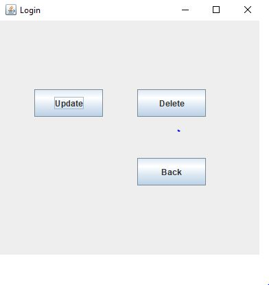

# Menu app

(P.S if someone want to use this app, he needs to have a database, and adjust the database information in JDBC.java)

The project is written by Java. The GUI is made up of java.swing.

The database is oracle SQL Server.

The user will only have one gui page in a time, and they can always click “back” button to go back to last page.

Homepage

Customer Side

Display Restaurants

The user can click the button “Find near restaurants” to sort the restaurants by distance. 

After user click the button “Find near restaurant”, a small message box will appear. 
user can input their x and y address there.

Then the restaurant list of sorting by closest distance from user will appear.

Finally people can still sort those restaurants by name.

User can click any restaurant in the list to read its menu.

Manager’s Side

When enter manager’s page, it will require manager to enter username and password. After input manager information, user can click continue to go into next page.

In manager’s home page, the manager can choose to add new restaurant, modify restaurant’s menu and delete restaurant.

After user click new restaurant. Then they can input restaurant information.	

 If the restaurant’s name already exist, it will link the restaurant to the same name restaurant.

 If the restaurant’s address already exist, it will report a error message. And the he go back to previous page.

If the user create a totally new restaurant, it will go to category page. And user can input food’s category such as drink, soup, entree and so on  in this page. If those textfield is not enough to input all the categories, the user can still click the button “add more” to add more categories. If they are done, they can click “next” button to add food into those categories.

The user will get into add food page in new page. The user can click the button “add more” to store food in database and add new food. When user has no more food to add, they can click “Done” to back to manager interface.. 

The manager can click “edit restaurant” to modify a restaurant’s menu, after they click edit restaurant” button. A restaurants list will appear. 

 The user can click any restaurant in the list, and the user can update food, add new food or delete exist food.

Click “Add new food” to add food.

They can also click the food from the list to delete or update them.

If the user click “Update”, the user can change food information. 

If the user click “Delete” the food information will be deleted from database.

The user can click “delete” in manager’s interface to delete any restaurant. They can click any restaurant in the list to delete them

Done. Those things above are all the things that this project can do.
